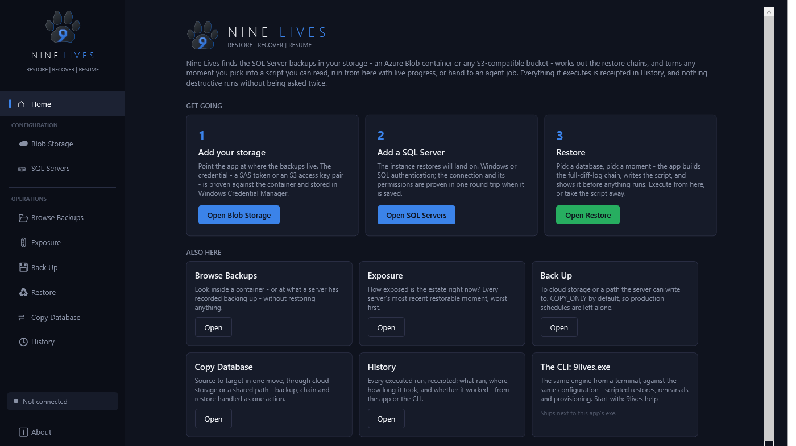
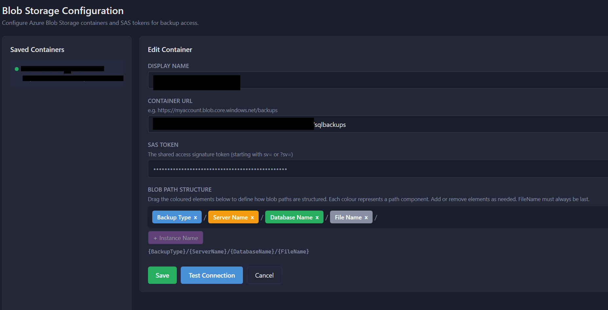
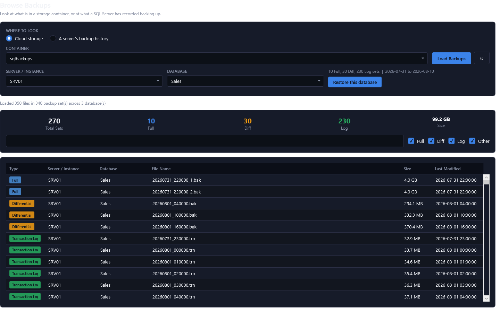
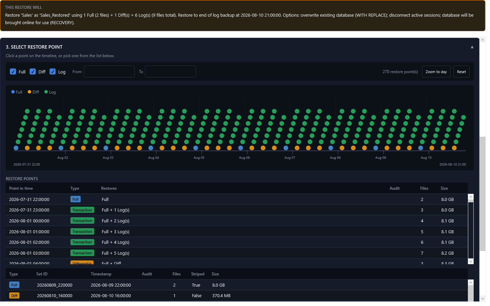
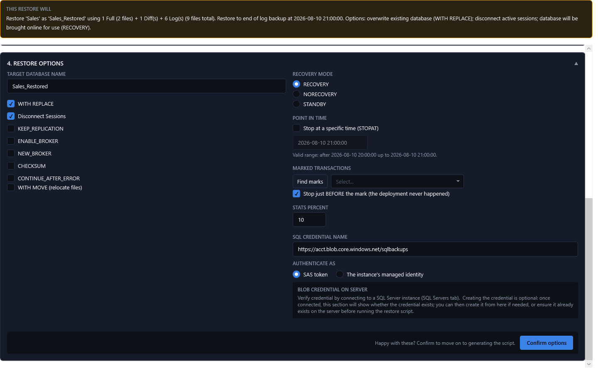
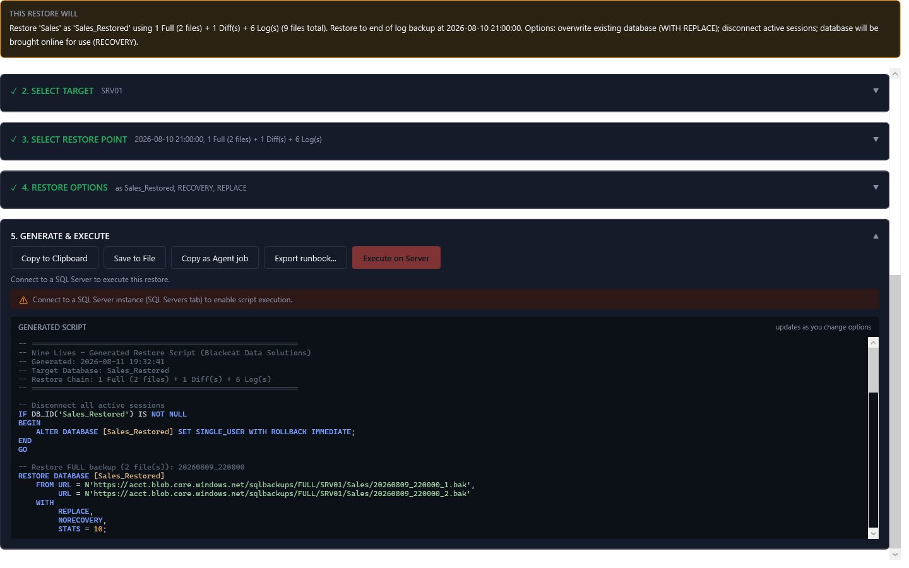

# Nine Lives 🐈‍⬛

[](https://github.com/jakemorgangit/NineLives/actions/workflows/build.yml)

**Every database deserves nine lives.**

Nine Lives is a modern desktop application for restoring SQL Server databases from Azure Blob Storage backups — point-in-time recovery with a visual timeline, intelligent backup chain detection, striped backup support, and secure credential management. Built with WPF on .NET 10, featuring a dark-mode UI.

*A free tool from [Blackcat Data Solutions](https://blackcat.wales).*



### Download Release

Download the latest release from the [Releases page](https://github.com/jakemorgangit/NineLives/releases).

The application is distributed as a single self-contained executable (`NineLives.exe`) — no installation required. Simply download and run.

## Why Nine Lives?

Restoring a native SQL Server backup from a blob container is painful with existing tooling when the destination server has no msdb backup history (the normal case for DR, environment refreshes, and migrations):

- **SSMS** makes you pick blobs from a container one file at a time, with no chain calculation and no timeline.
- **dbatools** (`Restore-DbaDatabase`) is excellent if you live in PowerShell — Nine Lives is the GUI complement, not a replacement. If your team prefers clicking a restore point on a timeline over composing cmdlet parameters mid-incident, this is for you.

Nine Lives points at a container, discovers every backup, groups striped sets, computes the full restore chain (full → differential → log tail), and gives you a clickable point-in-time timeline. Generate the T-SQL, or execute it directly with live progress.

## Features

### Azure Blob Storage Integration
- Connect to Azure Blob Storage containers using SAS tokens, or Entra ID for organisations that prohibit long-lived SAS ([see the caveat](#entra-id-for-blob-storage))
- Automatic discovery of backup files (Full, Differential, Transaction Log)
- Intelligent parsing of blob path structures with customisable patterns
- Support for striped backup sets (multiple files per backup)
- Availability Group backups using Ola Hallengren's default AG naming (`Cluster$AG_Database_FULL_yyyymmdd_hhmmss_n.bak`)
- Secure SAS token storage using Windows Credential Manager

### SQL Server Connectivity
- Windows Authentication and SQL Server Authentication support
- Entra ID authentication — interactive (MFA), integrated, and default — for Azure SQL Managed Instance and Entra-enabled estates ([see the caveat](#entra-id-authentication))
- Configurable connection options (Encrypt, Trust Server Certificate, Timeout)
- Persistent server configurations with secure password storage
- Real-time connection status visible across all views

### Backup Discovery & Browsing
- Browse all backups in a container with filtering by server, database, and type
- Automatic inference of database names from folder structures
- Configurable blob path pattern builder with drag-and-drop components
- Summary statistics showing backup set counts (not just file counts)

### Point-in-Time Recovery
- Visual timeline of restore points across Full, Differential, and Log backups
- Colour-coded dots for Full (blue), Differential (orange), and Log (green) backups
- Clickable restore points with automatic chain calculation
- Intelligent backup chain building including required differentials
- **Stop at an exact moment (`STOPAT`)** — select a transaction log restore point and specify a
  precise time within it, rather than being limited to the end of a log backup. `STOPAT` is
  emitted on every `RESTORE LOG` in the chain, so recovery stops in whichever log actually
  contains the target time.

### Restore Script Generation
- Complete T-SQL restore scripts with proper `FROM URL` syntax
- **No SAS token or credential in scripts** — the generated script never contains credentials; the SQL Server must already have a credential for the blob container URL (or you create it from the app)
- Restore options show whether the blob credential exists on the connected server; optional "Create credential on server" so you can create/update it without putting the token in any script
- Support for all common restore options:
  - `WITH REPLACE` - Overwrite existing database
  - `WITH MOVE` - Relocate data/log files (auto-detects server default paths)
  - Recovery modes: `RECOVERY`, `NORECOVERY`, `STANDBY`
  - `KEEP_REPLICATION`, `ENABLE_BROKER`, `NEW_BROKER`
  - Configurable `STATS` percentage
- Disconnect sessions option (`SET SINGLE_USER WITH ROLLBACK IMMEDIATE`)

### Direct Execution
- Execute restore scripts directly against connected SQL Server instances
- Real-time progress logging with auto-scroll
- Safe "arm-to-execute" confirmation
- Full restore chain execution with progress feedback in execution console

## Screenshots

### Blob Storage Configuration


*Configure Azure Blob Storage containers with SAS tokens. Drag-and-drop path pattern builder for custom folder structures.*

### Browse Backups


*Browse all backups with filtering by server, database, and backup type. Summary shows set counts accounting for striped backups.*

### Restore Timeline


*Visual timeline with clickable restore points. Select any point to see the complete restore chain required.*

### Restore Options


*Configure restore options including WITH MOVE with auto-detected server paths, recovery mode, and more.*

### Script Generation & Execution


*Generate restore scripts or execute directly with real-time progress logging.*

## Installation

### Download Release

Download the latest release from the [Releases page](https://github.com/jakemorgangit/NineLives/releases).

**Requirements:**
- Windows 10/11 (x64)
- No .NET runtime installation required (self-contained)

### "Windows protected your PC"

The executable is not yet code-signed, so SmartScreen will stop it the first time you run it.
Click **More info** → **Run anyway**.

That warning means Windows has not seen this file before — not that anything is wrong with it. But
you shouldn't have to take that on faith for a tool you're about to point at production with
sysadmin rights, so there are two ways to check.

**Checksum** — confirms the file matches what the release page publishes:

```powershell
Get-FileHash NineLives.exe -Algorithm SHA256
```

Compare against `SHA256SUMS.txt` on the release.

**Build provenance** — confirms the file was built by this repository's release workflow, from a
specific commit, and has not been altered since. Needs the [GitHub CLI](https://cli.github.com):

```powershell
gh attestation verify NineLives.exe --repo jakemorgangit/NineLives
```

A pass prints the commit and workflow that produced it. This is a stronger guarantee than the
checksum, which only proves the file matches a number published beside it.

Getting the exe signed properly is tracked in
[#33](https://github.com/jakemorgangit/NineLives/issues/33); the options are written up in
[docs/code-signing.md](docs/code-signing.md).

### Build from Source

#### Prerequisites
- [.NET 10 SDK](https://dotnet.microsoft.com/download/dotnet/10.0) or later
- Windows 10/11 (WPF application)

#### Clone and Build

```bash
git clone https://github.com/jakemorgangit/NineLives.git
cd NineLives
dotnet build
```

#### Run in Development

```bash
dotnet run --project src/NineLives
```

#### Run Tests

```bash
dotnet test
```

#### Publish Single-File Executable

```bash
dotnet publish src/NineLives -c Release -r win-x64 --self-contained true -p:PublishSingleFile=true -p:IncludeNativeLibrariesForSelfExtract=true -o ./publish
```

The executable will be created at `./publish/NineLives.exe`.

## Usage Guide

### 1. Configure Blob Storage

1. Navigate to **Blob Storage** in the sidebar
2. Click **+ Add Container**
3. Enter a display name for the container
4. Enter the full container URL (e.g., `https://mystorageaccount.blob.core.windows.net/sqlbackups`)
5. Choose how to authenticate:
   - **SAS token** — paste one with at least `list` and `read` permissions
   - **Entra ID** — nothing to paste, and nothing is stored ([caveat below](#entra-id-for-blob-storage))
6. Configure the **Blob Path Structure** to match your backup folder layout:
   - Default: `{BackupType}/{ServerName}/{DatabaseName}/{FileName}`
   - Drag and drop components to rearrange
   - Add `{InstanceName}` if your paths include SQL instance names
   - For Availability Group backups, select the AG source type (supports Ola Hallengren default AG naming and cluster/AG path tokens)
7. Click **Test Connection** to verify access
8. Click **Save**

#### Entra ID for Blob Storage

> **Untested against a real tenant.** There is no Entra-enabled storage account to develop this
> against, so what is verified is which credential the app uses and what it stops storing — not that
> a token is accepted. **Test Connection** will tell you honestly whether it works; please open an
> issue either way.

| Mode | What it does | When to pick it |
| --- | --- | --- |
| **Interactive (MFA)** | Opens a browser to sign in. The sign-in lasts as long as the app is running and is written nowhere | Any Entra-enabled account, including MFA |
| **Default** | Environment, then managed identity, then Azure CLI / Visual Studio sign-in, then a prompt | Running the app on an Azure VM with a managed identity |

Your account needs **Storage Blob Data Reader** on the container. Owner or Contributor on the
subscription is not enough on its own — the data-plane roles are separate from the management-plane
ones, which is the usual first surprise.

Switching a container from SAS to Entra deletes its stored token from Windows Credential Manager. An
organisation that has banned long-lived SAS has banned it wherever it is sitting.

**This covers browsing only.** The RESTORE itself runs on SQL Server, which needs its own credential
for the container URL — for Entra that is `CREATE CREDENTIAL ... WITH IDENTITY = 'Managed Identity'`
on SQL Server 2022+ or Azure SQL MI. Entra on the client and a SAS credential on the server is a
perfectly valid combination.

### 2. Configure SQL Server (Optional - for direct execution)

1. Navigate to **SQL Servers** in the sidebar
2. Click **+ Add Server**
3. Enter server details and authentication method
4. Configure encryption and certificate options as needed
5. Click **Test Connection** to verify
6. Click **Save**
7. Select the server and click **Connect** to establish a session

#### Entra ID authentication

> **Untested against a real tenant.** There is no Entra-enabled instance to develop this against, so
> what is verified is the connection string handed to the driver, not that a sign-in succeeds. The
> token flow itself belongs to `Microsoft.Data.SqlClient`. **Test Connection** will tell you honestly
> whether it works — please open an issue either way.

Three modes, all of which store nothing:

| Mode | What it does | When to pick it |
| --- | --- | --- |
| **Interactive (MFA)** | Opens a browser to sign in | The mode that satisfies multi-factor authentication. Optionally give a username to pre-select the account |
| **Integrated** | Uses the Windows account you are already signed in with, no prompt | Machine joined to the directory |
| **Default** | Environment, then managed identity, then the signed-in account, then a prompt | SQL Server on an Azure VM, where the managed identity should be used |

Switching a saved connection from SQL Authentication to any other mode deletes its stored password
from Windows Credential Manager — a secret nothing uses any more should not outlive the reason it
was stored.

Note that this covers **the app's own connection to SQL Server**. Restoring `FROM URL` still needs a
credential on the *instance* for the blob container, which is separate and configured on the server.

### 3. Browse Backups

1. Navigate to **Browse Backups** in the sidebar
2. Select your configured container from the dropdown
3. Click **Load Backups**
4. Use filters to narrow down by server, database, or backup type
5. Review the summary showing backup set counts

### 4. Restore a Database

1. Navigate to **Restore** in the sidebar
2. Select your container and click **Load Backups**
3. Filter by server/database if needed
4. Click a restore point on the timeline (or in the list)
5. Review the restore chain in the details panel
6. Configure restore options:
   - **Target Database Name** - Name for the restored database
   - **WITH REPLACE** - Overwrite if database exists
   - **WITH MOVE** - Relocate files (paths auto-detected from connected server)
   - **Recovery Mode** - RECOVERY (online), NORECOVERY (for more restores), or STANDBY
   - **Point in Time** - when a transaction log restore point is selected, tick *Stop at a
     specific time* and enter the target as `yyyy-MM-dd HH:mm:ss`. The time must fall within the
     selected log's window (after the previous restore point, up to the selected one); to stop
     earlier or later, pick a different point on the timeline.
7. Click **Generate Script** to create the T-SQL
8. Either:
   - **Copy to Clipboard** or **Save to File** to run manually in SSMS
   - **Execute on Server** to run directly (requires connected SQL Server)

### 5. Execute Restore

When clicking **Execute on Server**:
1. The button changes to "Confirm Execute (5)" with a countdown
2. A warning banner appears showing the target server and database
3. Click the button again within 5 seconds to confirm
4. Watch the real-time execution log for progress
5. Upon completion, the database is restored and online (if RECOVERY mode selected)

## SAS Token Requirements

Your SAS token needs the following minimum permissions:
- **List (l)** - To enumerate blobs in the container
- **Read (r)** - To read backup files

For restore execution, the SQL Server instance must have a credential for the blob container URL (identity `SHARED ACCESS SIGNATURE`). You can create or update this credential from the app using "Create credential on server" in the Restore options; the SAS token is never included in generated scripts.

Example SAS token permissions: `sp=rl` (read + list)

Recommended: `sp=racwdl` (read, add, create, write, delete, list) for full functionality.

## Backup Folder Structure

The application parses backup file paths to infer metadata. Configure the path pattern to match your structure.

### Default Pattern
```
{BackupType}/{ServerName}/{DatabaseName}/{FileName}
```

Example paths:
```
FULL/SQLSERVER01/AdventureWorks/20240115_220000_1.bak
DIFF/SQLSERVER01/AdventureWorks/20240116_060000_1.bak
LOG/SQLSERVER01/AdventureWorks/20240116_070000.trn
```

### With Instance Name
```
{BackupType}/{ServerName}/{InstanceName}/{DatabaseName}/{FileName}
```

Example:
```
FULL/SQLSERVER01/MSSQLSERVER/AdventureWorks/20240115_220000.bak
```

### Availability Group Backups (Ola Hallengren default naming)

Flat filenames using Ola's default AG format are parsed automatically:
```
azdbcluster1$MyAG_MyDatabase_FULL_20260226_200032_1.bak
azdbcluster1$MyAG_MyDatabase_LOG_20260226_210500_1.trn
```

Path-based AG layouts are also supported via the `{ClusterName}`, `{AgName}`, `{ClusterName$AgName}`, and `{ClusterName_AgName}` tokens.

### Striped Backups

The application automatically detects striped backup sets by filename pattern:
```
20240115_220000_1.bak
20240115_220000_2.bak
20240115_220000_3.bak
20240115_220000_4.bak
```

These are grouped as a single backup set with 4 files.

## Restore Chain Logic

The application builds complete restore chains automatically:

1. **Full Backup** - Always required as the base
2. **Differential Backup** - The latest differential since the full (differentials are cumulative)
3. **Transaction Logs** - All logs after the differential (or full if no diffs)

When you select a transaction log restore point, the chain includes:
- The most recent full backup before that log
- The latest differential between the full and the log
- All transaction logs from the differential to your selected point

## Security

### Credential Storage

- **SAS Tokens** - Stored securely in Windows Credential Manager
- **SQL Passwords** - Stored securely in Windows Credential Manager
- **Configuration** - Non-sensitive settings stored in `%LOCALAPPDATA%\NineLives\config.json`

### SAS Token Handling

- **After save, the token is never shown again** — once a SAS token is saved for a container, it cannot be viewed in the UI; you can only replace it by entering a new token. This reduces the risk of exposure.
- For new containers (before save), you can type the token and optionally show/hide it while editing.

## Architecture

Built with:
- **.NET 10** (LTS) - Windows Presentation Foundation (WPF)
- **CommunityToolkit.Mvvm** - MVVM pattern implementation
- **Azure.Storage.Blobs** - Azure Blob Storage SDK
- **Microsoft.Data.SqlClient** - SQL Server connectivity

### Project Structure
```
NineLives/
├── .github/
│   └── workflows/               # CI: PR build/test gate, version-bump gate, release pipeline
├── docs/
│   └── screenshots/             # README screenshots
├── src/
│   ├── NineLives/
│   │   ├── Assets/              # Application icon
│   │   ├── Converters/          # XAML value converters
│   │   ├── Models/              # Data models
│   │   ├── Properties/          # Publish profiles
│   │   ├── Services/            # Business logic services
│   │   ├── Themes/              # Dark theme resources
│   │   ├── ViewModels/          # MVVM ViewModels
│   │   └── Views/               # XAML views
│   └── NineLives.Tests/         # xunit tests (chain logic, parsers, script generation)
├── build_standalone.cmd         # One-shot publish script
└── NineLives.sln                # Solution file
```

## Known Limitations

- Windows only (WPF application)
- x64 architecture only
- SAS token authentication only (no Azure AD/Managed Identity yet)
- Single container per restore operation

## Troubleshooting

### "AuthorizationFailure" when connecting to blob storage
- Verify your SAS token has `list` permission
- Check the token hasn't expired
- Ensure the container URL is correct (no trailing slash)

### "File cannot be restored to..." error
- Enable **WITH MOVE** option
- Connect to SQL Server first to auto-detect default paths
- Manually specify data/log file paths

### Database left in "RESTORING" state
- This is expected if you selected **NORECOVERY** mode
- Run `RESTORE DATABASE [YourDB] WITH RECOVERY` to bring it online

## Contributing

Contributions are welcome — see [CONTRIBUTING.md](CONTRIBUTING.md) for the full guide.

In short: **`dev` is the default branch and where work lands; `main` tracks the released code.**
Fork, branch from `dev`, and open your pull request against `dev`. Releases are a `dev` → `main`
pull request with a version bump.

## License

This project is licensed under the MIT License - see the [LICENSE](LICENSE) file for details.

## Author

**Jake Morgan** - [Blackcat Data Solutions Ltd](https://blackcat.wales)

## Acknowledgements

- UI design inspired by [Erik Darling's SQL Performance tools](https://github.com/erikdarlingdata/PerformanceMonitor)
- Built with [CommunityToolkit.Mvvm](https://github.com/CommunityToolkit/dotnet)
